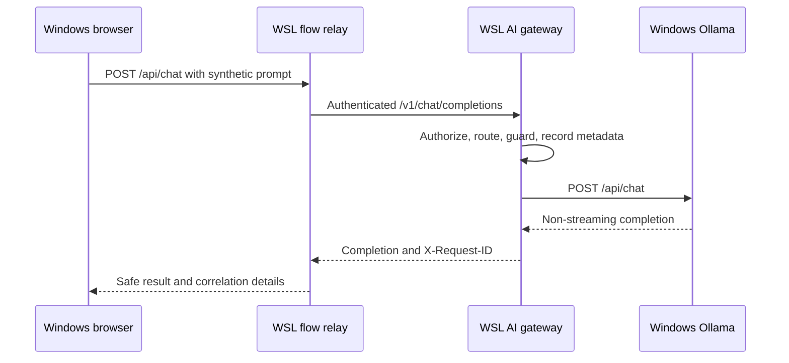

# Local Windows/WSL flow application

This disposable browser application tests the gateway with Ollama running on the
same Windows workstation. The relay and gateway run as native Python processes in
WSL. Docker and Cloudflare are not required.



The gateway key is generated when the launcher starts and remains in the WSL
process environment. It is never placed in HTML, JavaScript, browser storage, or
the request from the browser to the relay. The application does not persist chats.

## Start

Prepare the project environment once from the repository root:

```bash
python3 -m venv .venv
. .venv/bin/activate
python -m pip install -e '.[dev]'
```

Confirm that Windows Ollama is reachable from WSL and has a model:

```bash
curl --fail-with-body http://127.0.0.1:11434/api/tags
```

Start both WSL processes with one command:

```bash
python -m examples.local_test_app.start
```

The launcher selects the first installed Ollama model and prints the selected
route. Open `http://localhost:8787` in the Windows browser. Enter only synthetic
content and run the flow. The result shows the resolved model, gateway-generated
request ID, latency, and token usage when Ollama reports it.

Press Ctrl+C in WSL to stop the relay and gateway. The temporary gateway key is
discarded with the processes.

If the launcher reports missing runtime dependencies, confirm that the intended
virtual environment is active and install the project into it:

```bash
python -m pip install -e '.[dev]'
```

## Select an explicit model

Set the model when more than one is installed or when model selection must be
repeatable:

```bash
LOCAL_TEST_MODEL='ollama:<installed-model>' python -m examples.local_test_app.start
```

The launcher never downloads a model. If `/api/tags` returns an empty list, install
a suitable model with the Windows Ollama application or CLI during an intentional
resource window, then rerun the launcher. The UI can still exercise the gateway's
safe provider-error path while the model is absent.

## Networking

The default uses WSL and Windows loopback forwarding:

| Component | Default |
| --- | --- |
| Windows Ollama | `http://127.0.0.1:11434` |
| WSL gateway | `http://127.0.0.1:8080` |
| WSL browser relay | `http://127.0.0.1:8787` |

If Ollama uses another reachable URL, set `OLLAMA_BASE_URL`. If the Windows browser
cannot reach the relay through `localhost`, set `LOCAL_TEST_HOST=0.0.0.0` and use
the WSL address shown by `hostname -I`. Use that fallback only on a trusted private
workstation with the host firewall enabled because it widens the bind address.

Ports can be changed with `LOCAL_TEST_GATEWAY_PORT` and `LOCAL_TEST_PORT`. The
launcher stops if either child process exits, so an occupied port fails visibly.

## Expected checks

1. The page reports the gateway as reachable.
2. An `auto` request resolves to the selected `ollama:<model>` route.
3. A successful response includes an `X-Request-ID` shown in the result panel.
4. The same ID appears in the gateway's JSON metadata event in the WSL terminal.
5. The prompt and completion remain absent from metadata and metrics when gateway
   content capture is disabled.
6. Stopping Windows Ollama produces a safe gateway error with a correlated ID.

This application covers non-streaming text chat only. It is a local integration
fixture and is not an authentication layer, public deployment, or replacement for
the separate Cloudflare Worker test.
